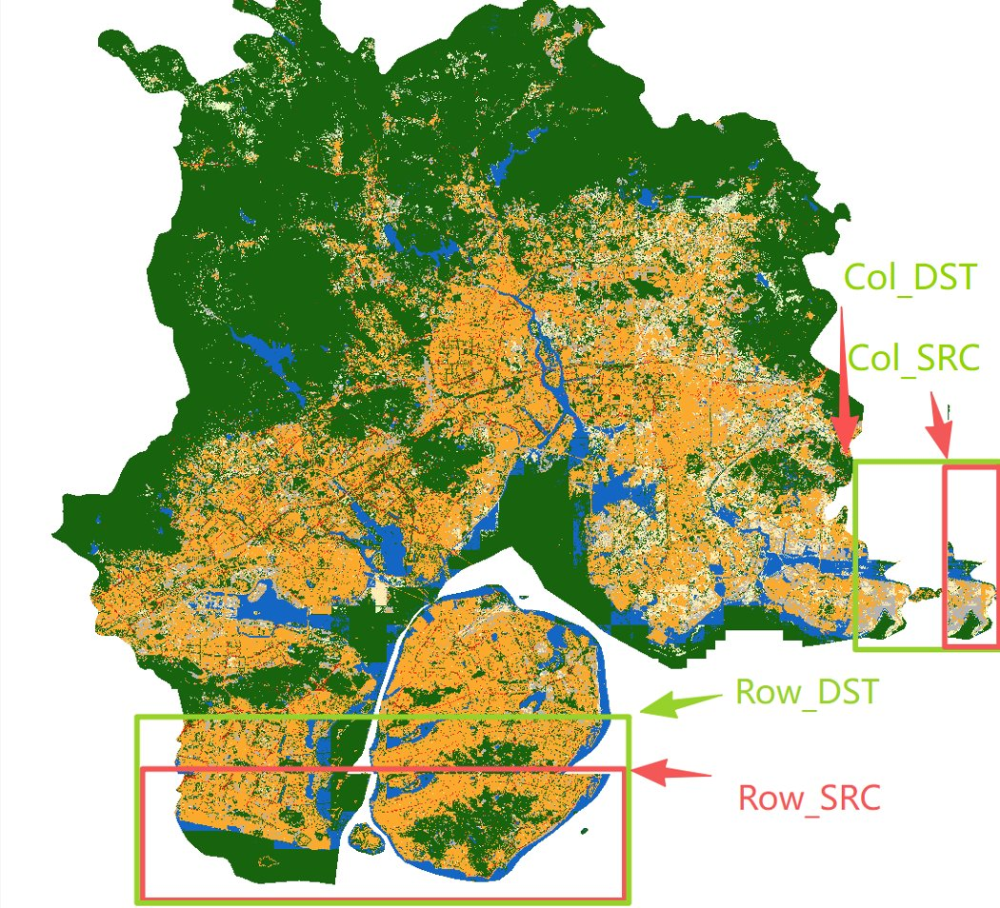
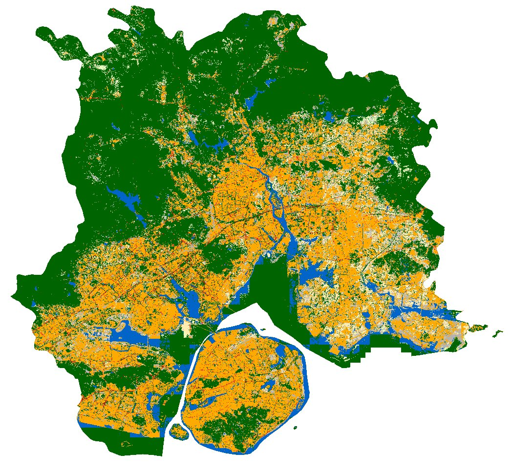

# tif_shift — GeoTIFF Boundary Duplicate Removal Tool

A command-line utility that fixes **repeated / overlapping boundary strips** in
classified single-band GeoTIFFs (land-cover maps, soil maps, geological maps,
etc.) by removing a user-defined column gap and a user-defined row gap, then
seamlessly closing both gaps through an in-place pixel shift.

All raster attributes are preserved in the output file:
ColorMap, Raster Attribute Table (RAT), CRS, GeoTransform, nodata value, dtype,
compression settings, and all metadata tags.

---

## The problem this tool solves

Tiled or stitched rasters sometimes contain **duplicated boundary strips** —
a narrow band of pixels on the right edge and/or bottom edge that is a copy
of data that already appears slightly further inward.  The duplicate strip
causes the map extent to appear artificially larger than the real study area
and produces visible seam artefacts when the raster is visualised or used in
downstream analysis.

| Before | After |
|--------|-------|
|  |  |

In the **Before** image the annotated boxes show the four pixel coordinates
you need to collect:

- **Col_DST** (green)  — the column where the duplicated right strip *begins*
  (i.e. the first column that should be replaced by real data from Col_SRC onward).
- **Col_SRC** (red)    — the column in the source raster whose data is the
  correct continuation; everything from here to the right edge is shifted
  left to Col_DST.
- **Row_DST** (green)  — the row where the duplicated bottom strip begins.
- **Row_SRC** (red)    — the row whose data is the correct continuation;
  everything from here to the bottom edge is shifted up to Row_DST.

The script deletes the gap `[Col_DST, Col_SRC)` and the gap `[Row_DST, Row_SRC)`,
producing the clean seamless map shown in the **After** image.

---

## How to collect the four coordinates

The four parameters must be read as **0-based pixel indices** from the source
raster.  The recommended workflow uses QGIS, but any GIS tool that reports
pixel coordinates works.

### Step-by-step in QGIS

1. **Open the source TIF** in QGIS (`Layer › Add Layer › Add Raster Layer`).

2. **Switch the coordinate display to pixel/column mode.**
   In the bottom status bar, right-click the coordinate box and choose
   *"Pixel coordinates"* (or use the *Identify Features* panel and note the
   `Column` / `Row` fields).

3. **Zoom into the right-edge duplicate strip.**
   Pan to the far-right boundary of the raster.  You will see a narrow band
   of pixels that visually duplicates the content just to its left.

   - Move your cursor to the **leftmost column of the duplicate strip** and
     read the column index → this is **`COL_DST_START`**.
   - Move your cursor to the **first column of genuinely new (non-duplicate)
     content** to the right of the gap → this is **`COL_SRC_START`**.

4. **Zoom into the bottom-edge duplicate strip** and repeat:
   - Leftmost row of the duplicate strip → **`ROW_DST_START`**.
   - First row of genuine content below the gap → **`ROW_SRC_START`**.

5. **Verify** that `COL_SRC_START > COL_DST_START` and
   `ROW_SRC_START > ROW_DST_START`.  The gap widths are:

   ```
   col_gap = COL_SRC_START - COL_DST_START   # columns to remove
   row_gap = ROW_SRC_START - ROW_DST_START   # rows to remove
   ```

6. **Open `tif_shift.py`** and update the four constants at the top of the
   *"Edit parameters"* block:

   ```python
   COL_SRC_START = 48046   # <-- your value
   COL_DST_START = 43455   # <-- your value
   ROW_SRC_START = 42164   # <-- your value
   ROW_DST_START = 39479   # <-- your value
   ```

> **Tip — using gdal_translate / gdalinfo instead of QGIS**
> Run `gdalinfo -mm yourfile.tif` to confirm the raster dimensions, then use
> the GDAL *Virtual Raster* preview or any pixel-picking tool to read column
> and row indices at the duplicate boundary.

---

## Installation

```bash
# Core dependency (pixel processing)
pip install rasterio numpy

# Optional — required only for Raster Attribute Table (RAT) copying
conda install -c conda-forge gdal
```

Python 3.8 or later is required.

---

## Usage

```bash
python tif_shift.py  input.tif  output.tif
```

### Options

| Argument | Default | Description |
|----------|---------|-------------|
| `input`  | —       | Path to the source single-band GeoTIFF. |
| `output` | —       | Path for the processed output GeoTIFF. |
| `--chunk-rows N` | `512` | Rows processed per iteration. Reduce if RAM is limited; increase for faster I/O. |

### Example

```bash
python tif_shift.py  landcover_raw.tif  landcover_fixed.tif  --chunk-rows 1024
```

Console output:

```
Source file : landcover_raw.tif
  Dimensions : 52000 cols x 48000 rows, 1 band(s), dtype=uint8
  Output     : 47409 cols x 45315 rows
  Col gap    : [43455, 48046)  ->  4591 columns removed
  Row gap    : [39479, 42164)  ->  2685 rows removed
  ColorMap   : found, 256 entries
  Writing pixels : 100.0%  (chunk 94/94)
  ColorMap written.
  Copying RAT ...
  RAT copied successfully (20 rows x 5 columns)
Done.  Output file: landcover_fixed.tif
```

---

## What is preserved in the output

| Attribute | Mechanism | Notes |
|-----------|-----------|-------|
| Pixel values | rasterio chunked read/write | Lossless; no resampling |
| ColorMap / palette | `rasterio.write_colormap` | Must be written before file close |
| Raster Attribute Table | `osgeo.gdal.SetDefaultRAT` | Written after file close in update mode |
| CRS | copied via `src.profile` | Unchanged |
| GeoTransform | origin unchanged; only width/height updated | Left and top edges do not move |
| nodata value | copied via `src.profile` | Unchanged |
| dtype | copied via `src.profile` | Unchanged |
| Dataset-level tags | `rasterio.update_tags` | Includes `AREA_OR_POINT` etc. |
| Band-level tags | `rasterio.update_tags(1, ...)` | Descriptions, units, scale/offset |

Output files are written as **tiled, Deflate-compressed GeoTIFF** and
automatically switch to **BigTIFF** format when the output exceeds 4 GB.

---

## Output dimensions

```
new_width  = src_width  - (COL_SRC_START - COL_DST_START)
new_height = src_height - (ROW_SRC_START - ROW_DST_START)
```

The geographic origin (top-left corner) of the output raster is identical to
that of the source, so the output can be directly overlaid with other layers
that share the same CRS without any re-registration.

---

---

## License

MIT
